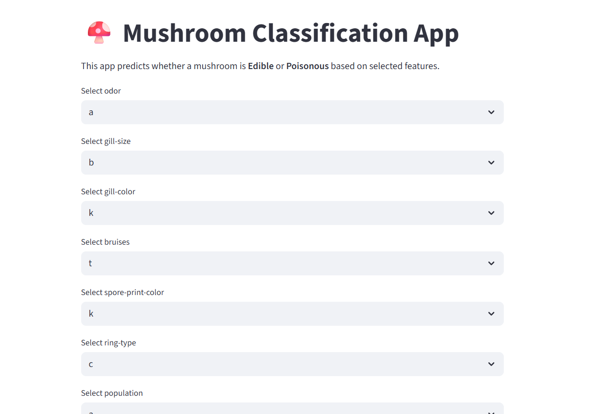

🍄 Mushroom Classification App

An interactive web app to classify mushrooms as edible or poisonous using machine learning. The app is powered by Streamlit, with preprocessing, feature engineering, and ML models trained on the Mushroom dataset.

🚀 Demo

🔗 Try it here: [Mushroom Classification App](https://mushroom-datset-hi86ctgjpjpyzljsorged7.streamlit.a)

📊 Project Overview

This project aims to help users explore mushroom characteristics and predict whether a mushroom is edible or poisonous based on features such as:

Cap shape, color, and surface

Gill size, spacing, and color

Stalk attributes

Odor

Habitat

Population

The dataset used is a classic mushroom dataset, commonly used in ML experiments.

🛠 Features

✅ Upload or select mushroom features manually
✅ Interactive predictions (edible vs poisonous)
✅ Data preprocessing (Label Encoding, handling skewness)
✅ Hyperparameter-tuned models (Random Forest, XGBoost, Logistic Regression, etc.)
✅ Real-time inference using Streamlit

⚙️ Tech Stack

Python 🐍

Pandas, NumPy → Data processing

Scikit-learn → Model training & evaluation

XGBoost → Boosting models

Matplotlib, Seaborn → Visualization

Streamlit → Web app deployment

📈 Model Training

Feature Engineering: Handling categorical features (Label Encoding), analyzing skewness.

Model Selection: RandomForest, XGBoost, Logistic Regression.

Hyperparameter Tuning: Used GridSearchCV for best parameters.

Evaluation: Accuracy, precision, recall, F1-score, confusion matrix.

Example best parameters found for XGBoost:

{'learning_rate': 0.1, 'max_depth': 7, 'n_estimators': 100}

📂 Project Structure
├── app.py                # Streamlit app script
├── dataset/              # Mushroom dataset
├── models/               # Saved models (pickle files)
├── notebooks/            # Jupyter notebooks for EDA & training
├── requirements.txt      # Dependencies
└── README.md             # Project documentation

▶️ How to Run Locally

Clone the repository

git clone https://github.com/yourusername/mushroom-classification.git
cd mushroom-classification

Install dependencies

pip install -r requirements.txt

Run the app

streamlit run app.py

📷 Screenshots

	
🌟 Future Enhancements

Add more visual analytics (feature importance plots, SHAP values).

Deploy with Docker for reproducibility.

Add user-uploaded CSV predictions.

🤝 Contributing

Contributions, issues, and feature requests are welcome!
Feel free to fork the repo and submit a PR.

📜 License

This project is licensed under the MIT License.

✨ Built with ❤️ using Python & Streamlit
